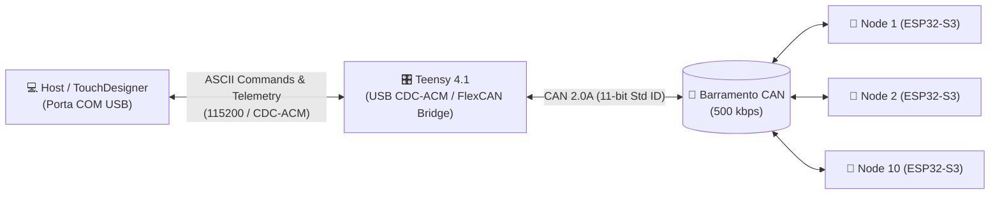

# Protocolo Serial do Teensy 4.1 — Bridge USB ↔ CAN

**Blue Mechanic V1 — 1 Teensy 4.1 e até 10 nós ESP32-S3**

Este documento define o contrato ASCII do bridge. O contrato CAN binário de referência está em [can_protocol.md](./can_protocol.md).

---

## 1. Visão Geral da Arquitetura

O **Teensy 4.1** atua como bridge entre a aplicação host (**TouchDesigner**, aplicativo Python ou terminal) conectada por USB CDC-ACM e até 10 nós ESP32-S3 em um barramento Classic CAN de 500 kbps. O Teensy usa FlexCAN; os ESP32-S3 usam TWAI on-chip.



---

## 2. Parâmetros de Comunicação Serial

* **Interface física:** porta USB device do Teensy 4.1.
* **Driver USB:** Virtual COM Port (CDC-ACM padrão, sem necessidade de drivers adicionais no Windows/Linux/macOS).
* **Baudrate:** 115200 bps (ignorado na camada USB física, transmissão na velocidade máxima USB High-Speed).
* **Terminação de Linha:** `\r\n` ou `\n`.
* **Formato de dados:** texto ASCII delimitado por espaços.
* **Nomes canônicos dos eixos:** `C` (base), `A` (pivot) e `Z` (linear).
* **Compatibilidade legada:** o bridge pode normalizar `X` para `C` e `Y` para `A`, mas toda nova integração deve emitir `C/A/Z`.
* **Frames CAN:** o bridge envia o DLC exato, sem byte de sequência.

---

## 3. Endereçamento e Broadcast

* **`node_id = 1` a `10`:** endereçamento individual. Apenas o módulo correspondente executa o comando.
* **`node_id = 0`:** broadcast em um único frame CAN com ID `0x200`. Pode ser usado em comandos de atuação.
* Broadcast não é sincronização temporal rígida. Cada ESP32 agenda a execução localmente e cada nó envia sua própria resposta.
* `PING` e `STATUS_REQUEST` exigem node individual para evitar uma rajada simultânea de respostas.

---

## 4. Tabela de Comandos de Envio (Host $\rightarrow$ Teensy)

| Comando | Sintaxe | Parâmetros | Descrição | Exemplo |
| :--- | :--- | :--- | :--- | :--- |
| **Move Normal** | `M <node> <eixo> <passos>` | `<node>`: 0..10<br>`<eixo>`: `C`, `A`, `Z`<br>`<passos>`: int32 | Move o eixo especificado com **respeito aos limites** de encoder/curso. | `M 1 C 800` *(gira +90° no node 1)*<br>`M 0 A -400` *(gira -45° em todos os 10 nodes)* |
| **Move Forçado** | `MF <node> <eixo> <passos>` | `<node>`: 0..10<br>`<eixo>`: `C`, `A`, `Z`<br>`<passos>`: int32 | C/A operam em malha aberta, sem encoder nem limites angulares. Z continua respeitando bloqueio, fim de curso, zero e curso máximo. | `MF 2 C 100`<br>`MF 0 Z 500` |
| **Homing** | `H <node> <eixo>` | `<node>`: 0..10<br>`<eixo>`: `C`, `A`, `Z` | C/A ajustam para o home salvo; Z busca o fim de curso, libera o sensor e zera a posição. | `H 1 Z`<br>`H 0 C` |
| **Enable Drivers** | `E <node> <estado>` | `<node>`: 0..10<br>`<estado>`: `1` (liga), `0` (desliga) | Liga ou desliga as saídas de potência dos drivers **TMC2209**. | `E 0 1` *(habilita motores de todos os nós)*<br>`E 1 0` *(desliga motores do node 1)* |
| **Nível de Velocidade** | `S <node> <nivel>` | `<node>`: 0..10<br>`<nivel>`: `1` a `5` | Define o nível de velocidade global dos eixos:<br>`1` = Muito Lenta (2000 µs/passo)<br>`2` = Lenta (800 µs/passo)<br>`3` = Média (400 µs/passo)<br>`4` = Rápida (150 µs/passo)<br>`5` = Turbo (50 µs/passo) | `S 0 3` *(configura velocidade média em todos)*<br>`S 1 4` *(velocidade rápida no node 1)* |
| **Laser PWM (12-bit)** | `L <node> <laser> <pwm>` | `<node>`: 0..10<br>`<laser>`: `1` ou `2`<br>`<pwm>`: `0` a `4095` | Ajusta a intensidade do canal de laser especificado (`0` = 0%, `4095` = 100%). | `L 0 1 4095` *(laser 1 em 100% em todos)*<br>`L 1 2 2048` *(laser 2 em 50% no node 1)*<br>`L 0 1 0` *(apaga laser 1 em todos)* |
| **Ventoinha (Cooler)** | `F <node> <modo>` | `<node>`: 0..10<br>`<modo>`: `0` (Off), `1` (On), `2` (Auto) | Define o modo de controle da ventoinha de resfriamento. | `F 0 2` *(modo térmico automático em todos)*<br>`F 1 1` *(força cooler ligado no node 1)* |
| **Solicitação de Status** | `R <node>` | `<node>`: 1..10 *(não usar 0)* | Solicita o envio imediato dos frames de **Status** e **Posição** do nó. | `R 1` *(solicita status do node 1)* |
| **Ping** | `P <node> [arg0] [arg1]` | `<node>`: 1..10<br>`arg0`, `arg1`: uint8 opcionais | Teste de conectividade. Quando omitidos, o Teensy envia ambos como zero. | `P 1 10 20` |

---

## 5. Mensagens de Retorno (Teensy $\rightarrow$ Host)

As mensagens recebidas pela porta USB CDC-ACM informam telemetria e estado de execução. Apenas o heartbeat é periódico por iniciativa do ESP32. `STATUS` e `POS` são enviados juntos em resposta ao comando `R`, a menos que o Teensy implemente polling próprio.

### 5.1. Posição dos Encoders e Temperatura (`POS`)
Emitido logo após `STATUS` quando o ESP32 responde a uma solicitação de status:
```
POS <node_id> <pos_c_deg> <pos_a_deg> <pos_z_steps> <temp_c>
```
* `<pos_c_deg>`: Posição angular real do Eixo C em Graus com 2 casas decimais (ex: `120.45`). Se inválido: `-1.00`.
* `<pos_a_deg>`: Posição angular real do Eixo A em Graus com 2 casas decimais (ex: `89.90`). Se inválido: `-1.00`.
* `<pos_z_steps>`: Posição linear atual do Eixo Z em passos (ex: `1500`).
* `<temp_c>`: Temperatura da placa em Graus Celsius com 1 casa decimal (ex: `28.5`).
* **Exemplo de linha recebida:**
  ```text
  POS 1 120.45 89.90 1500 28.5
  ```

---

### 5.2. Status Geral dos Periféricos (`STATUS`)
Contém o estado detalhado dos sensores, relés e drivers:
```
STATUS <node_id> <flags> <laser1_pwm> <laser2_pwm> <fan_on> <fan_mode> <speed_lvl>
```
* `<flags>`: Máscara binária de 8 bits com os seguintes flags:
  * `bit 0` (`0x01`): Drivers de motor habilitados (Potência ligada)
  * `bit 1` (`0x02`): Eixo Z bloqueado pelo sensor de fim de curso
  * `bit 2` (`0x04`): Alarme de Z ativo
  * `bit 3` (`0x08`): Leitura do sensor de temperatura válida
  * `bit 4` (`0x10`): Comunicação UART TMC2209 Online
  * `bit 5` (`0x20`): Barramento CAN Online
* `<laser1_pwm>`: Nível PWM do Laser 1 (`0` a `4095`).
* `<laser2_pwm>`: Nível PWM do Laser 2 (`0` a `4095`).
* `<fan_on>`: `1` se o cooler estiver girando, `0` se desligado.
* `<fan_mode>`: Modo do cooler (`0` = Manual Off, `1` = Manual On, `2` = Automático).
* `<speed_lvl>`: Nível de velocidade ativo (`1` a `5`).
* **Exemplo de linha recebida:**
  ```text
  STATUS 1 33 4095 0 1 2 4
  ```

---

### 5.3. Eventos de Movimento e Conectividade

| Mensagem | Significado | Exemplo |
| :--- | :--- | :--- |
| **`ACK <node> <opcode>`** | Comando rápido processado ou movimento/homing aceito na fila. | `ACK 1 20` *(MOVE aceito pelo node 1)* |
| **`DONE <node> <opcode>`** | Processamento de movimento/homing encerrado. Pode representar movimento limitado pelo firmware. | `DONE 1 20` |
| **`ERROR <node> <opcode> <err>`** | Comando rejeitado ou falha durante a execução. | `ERROR 1 20 03` |
| **`HEARTBEAT <node>`** | Sinal de pulso vital periódico transmitido a cada 1 segundo por cada nó ativo. | `HEARTBEAT 1` |
| **`PONG <node> <arg0> <arg1>`** | Resposta ao comando `PING`. | `PONG 1 10 20` |
| **`TEENSY_ERROR <motivo>`** | Erro de sintaxe ou falha de transmissão na ponte USB/CAN do Teensy. | `TEENSY_ERROR INVALID_NODE_ID 99` |

`opcode` e `err` são impressos com dois dígitos hexadecimais, sem prefixo `0x`. O protocolo CAN atual não possui sequência; por isso, o host não deve manter vários movimentos do mesmo opcode pendentes para o mesmo nó. Um movimento aceito também pode ser removido da fila pelo firmware quando um novo movimento oposto substitui comandos pendentes. Nessa situação, não há `DONE` para o item removido.

---

## 6. Conversão cinemática padrão

Os valores abaixo consideram motor de 200 passos/volta, microstepping 1/16 e polia Z de 16 dentes. Como esses parâmetros são configuráveis no ESP32, o host deve recalcular as conversões quando a configuração mudar.

| Eixo | Mecânica | Relação de Conversão | Ângulo / Deslocamento por Passo |
| :--- | :--- | :--- | :--- |
| **Eixo C (Base Rotativa)** | Motor NEMA + Microstepping 1/16 (3200 passos/volta) | $800\text{ passos} = 90^\circ$<br>$400\text{ passos} = 45^\circ$<br>$133\text{ passos} \approx 15^\circ$ | $0.1125^\circ / \text{passo}$ |
| **Eixo A (Pivot Lasers)** | Motor NEMA + Microstepping 1/16 (3200 passos/volta) | $800\text{ passos} = 90^\circ$<br>$400\text{ passos} = 45^\circ$<br>$133\text{ passos} \approx 15^\circ$ | $0.1125^\circ / \text{passo}$ |
| **Eixo Z (Atuador Linear)**| Correia GT2 (Passo 2mm) + Polia 16 Dentes | $100\text{ passos} = 1.0\text{ mm}$<br>$1000\text{ passos} = 10.0\text{ mm}$ | $0.01\text{ mm} / \text{passo}$ |

---

## 7. Fita de LEDs RGB WS2812 (12 LEDs de Diagnóstico)

O contrato visual previsto para o Teensy usa uma fita de **12 LEDs WS2812** no **pino 14** para diagnóstico do barramento e dos nós:

### 7.1. Mapeamento Físico dos LEDs

```text
[LED 0] : CAN Bus OK / Atividade
[LED 1] : Conexão Serial USB CDC-ACM
[LED 2] : Node 1
[LED 3] : Node 2
[LED 4] : Node 3
[LED 5] : Node 4
[LED 6] : Node 5
[LED 7] : Node 6
[LED 8] : Node 7
[LED 9] : Node 8
[LED 10]: Node 9
[LED 11]: Node 10
```

### 7.2. Padrões de Cores e Significados

| Canal | Estado | Cor / Animação | Significado |
| :--- | :--- | :--- | :--- |
| **LED 0 (CAN Bus)** | Normal | 🟢 **Verde Fixo** | Barramento CAN ativo e recebendo frames. |
| | Tráfego | 🔵 **Piscada Azul** | Frame CAN transmitido ou recebido. |
| | Falha | 🔴 **Vermelho** | Sem tráfego CAN há mais de 2.5s ou barramento em erro. |
| **LED 1 (USB Serial)** | Normal | 🟢 **Verde Fixo** | Porta USB CDC-ACM conectada e ativa. |
| | Tráfego | 🔵 **Piscada Azul** | Comando recebido ou telemetria enviada via USB. |
| | Standby | 🟠 **Laranja / Âmbar** | Aguardando comandos na porta serial. |
| **LEDs 2..11 (Nodes 1..10)** | **ONLINE** | 🟢 **Verde Piscante** | Nó ativo e com heartbeat recente. |
| | **COMANDO OK** | 🔵 **Piscada Rápida Azul** | Comando enviado ao nó ou `ACK`/`DONE` recebido. |
| | **ERROR** | 🔴 **Vermelho Piscante Rápido** | Nó reportou erro ou falha de limite/sensor. |
| | **OFFLINE** | 🔴 **Vermelho Fraco Estático** | Nó desligado ou sem resposta há mais de 2.5s. |

---

## 8. Uso no aplicativo Python

O aplicativo em `python_app` oferece três interfaces físicas independentes:

* **ESP32-S3 Serial Direta:** usa os comandos extensos do firmware, como `STATUS`, `MOVE C 800` e `LASER 1 4095`.
* **Teensy USB/CAN:** usa exclusivamente o contrato compacto deste documento, incluindo o `node_id` em cada comando.
* **PeakCAN:** envia e recebe diretamente os frames CAN binários, sem passar pelo Teensy.

Para usar o bridge, selecione **Teensy USB/CAN**, escolha a porta COM USB, o baudrate `115200` e um node de `1` a `10`. O app envia `R <node>` periodicamente e atualiza a tela somente com `STATUS`, `POS`, eventos e heartbeat do node selecionado; mensagens dos demais nodes continuam visíveis no terminal bruto.

Os botões de movimento, home, drivers, velocidade global, lasers e fan são convertidos respectivamente para `M/MF`, `H`, `E`, `S`, `L` e `F`. Operações que o firmware atual do bridge não expõe — gravação de NVS, alteração individual de velocidade/aceleração, alarme Z e movimento sincronizado — retornam “não suportado” e não enviam comandos da serial direta do ESP32.
